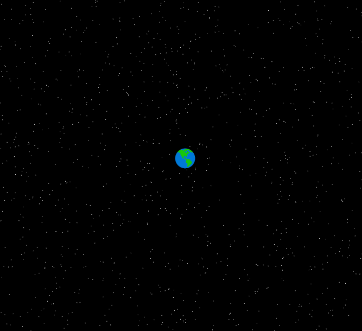

# physarum: autonomous space colonization

 
 
 

*inspired by [physarum polycephalum](https://en.wikipedia.org/wiki/Physarum_polycephalum)*

## overview
- watch as drones navigate deep space and adjust their strategy
- drones act as virtual slime mold, exploring and colonizing galaxies

## run
1. `git clone https://github.com/klayza/physarum`
2. open `index.html` in browser
3. watch the fleet grow... or perish

## todo
- [ ] implement drone movement patterns
- [ ] add galaxy discovery mechanics
- [ ] optimize for large-scale simulations
- [ ] add user controls for simulation parameters

## tech
- html5 canvas
- javascript
- css

*// nature-inspired algorithms for cosmic exploration*